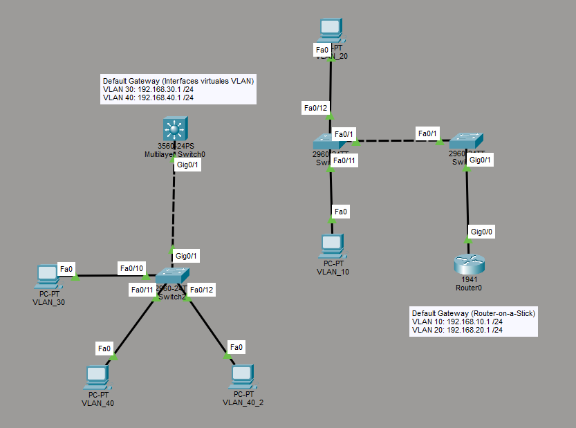

# Semana No. 1 (25/07/2026) - Ejercicio práctico

## Descripción

En esta práctica se configuró una red en **Cisco Packet Tracer** utilizando VLANs para separar los equipos por departamentos.

También se trabajó con:

- **VTP**, para compartir las VLANs entre switches.
- **Puertos access**, para conectar las computadoras a una VLAN específica.
- **Puertos trunk**, para transportar varias VLANs entre dispositivos.
- **Default Gateway**, para que cada computadora pueda salir de su red.
- **Inter-VLAN Routing**, para permitir la comunicación entre diferentes VLANs.



## VLANs utilizadas

| VLAN | Nombre         | Red             | Máscara       | Default Gateway |
| ---: | -------------- | --------------- | ------------- | --------------- |
|   10 | ventas         | 192.168.10.0/24 | 255.255.255.0 | 192.168.10.1    |
|   20 | secretaria     | 192.168.20.0/24 | 255.255.255.0 | 192.168.20.1    |
|   30 | administracion | 192.168.30.0/24 | 255.255.255.0 | 192.168.30.1    |
|   40 | juridico       | 192.168.40.0/24 | 255.255.255.0 | 192.168.40.1    |

## Direccionamiento de las computadoras

| Equipo | VLAN | Dirección IP | Máscara       | Default Gateway |
| ------ | ---: | ------------ | ------------- | --------------- |
| PC0    |   10 | 192.168.10.2 | 255.255.255.0 | 192.168.10.1    |
| PC1    |   10 | 192.168.10.3 | 255.255.255.0 | 192.168.10.1    |
| PC2    |   20 | 192.168.20.2 | 255.255.255.0 | 192.168.20.1    |
| PC3    |   30 | 192.168.30.2 | 255.255.255.0 | 192.168.30.1    |
| PC4    |   40 | 192.168.40.2 | 255.255.255.0 | 192.168.40.1    |
| PC5    |   40 | 192.168.40.3 | 255.255.255.0 | 192.168.40.1    |

Las direcciones `192.168.X.1` fueron utilizadas como puertas de enlace. En las VLAN 10 y 20, el gateway se configuró en el router. En las VLAN 30 y 40, el gateway se configuró en el switch multicapa.

---

# Configuración de los dispositivos

## Switch0

Este switch funciona como **cliente VTP**. Recibe las VLAN 10 y 20 desde el switch1, configurado como servidor VTP.

```cisco
enable
configure terminal

no ip domain lookup

! Configuración de VTP
vtp mode client
vtp version 2
vtp domain clase1

! Puerto trunk hacia Switch1
interface FastEthernet0/1
 switchport mode trunk
 switchport trunk allowed vlan all
 exit

! Puerto de acceso para VLAN 10
interface FastEthernet0/11
 switchport mode access
 switchport access vlan 10
 exit

! Puerto de acceso para VLAN 20
interface FastEthernet0/12
 switchport mode access
 switchport access vlan 20
 exit

end
write memory
```

## Switch1

Este switch funciona como **servidor VTP** para las VLAN 10 y 20. Desde este equipo se crean las VLANs y se comparten con el switch0 (cliente).

```cisco
enable
configure terminal

! Configuración de VTP
vtp mode server
vtp version 2
vtp domain clase1

! Creación de VLAN 10
vlan 10
 name ventas
 exit

! Creación de VLAN 20
vlan 20
 name secretaria
 exit

! Puerto trunk hacia Switch0
interface FastEthernet0/1
 switchport mode trunk
 switchport trunk allowed vlan all
 exit

! Puerto trunk hacia Router0
interface GigabitEthernet0/1
 switchport mode trunk
 switchport trunk allowed vlan all
 exit

end
write memory
```

## Router0

El router utiliza la técnica **Router-on-a-Stick**. Se crean subinterfaces sobre la interfaz física `GigabitEthernet0/0`, una para cada VLAN.

```cisco
enable
configure terminal

! Activar la interfaz física
interface GigabitEthernet0/0
 no shutdown
 exit

! Subinterfaz para VLAN 10
interface GigabitEthernet0/0.10
 encapsulation dot1Q 10
 ip address 192.168.10.1 255.255.255.0
 exit

! Subinterfaz para VLAN 20
interface GigabitEthernet0/0.20
 encapsulation dot1Q 20
 ip address 192.168.20.1 255.255.255.0
 exit

end
write memory
```

La subinterfaz `.10` funciona como puerta de enlace para la VLAN 10 y la subinterfaz `.20` funciona como puerta de enlace para la VLAN 20.

## Switch2

Este switch funciona como **servidor VTP** para las VLAN 30 y 40.

```cisco
enable
configure terminal

! Configuración de VTP
vtp mode server
vtp version 2
vtp domain admin

! Creación de VLAN 30
vlan 30
 name administracion
 exit

! Creación de VLAN 40
vlan 40
 name juridico
 exit

! Puerto trunk hacia el switch multicapa
interface GigabitEthernet0/1
 switchport mode trunk
 switchport trunk allowed vlan all
 exit

! Puerto de acceso para VLAN 30
interface FastEthernet0/10
 switchport mode access
 switchport access vlan 30
 exit

! Puerto de acceso para VLAN 40
interface FastEthernet0/11
 switchport mode access
 switchport access vlan 40
 exit

! Segundo puerto de acceso para VLAN 40
interface FastEthernet0/12
 switchport mode access
 switchport access vlan 40
 exit

end
write memory
```

## Multilayer Switch0

El switch multicapa funciona como **cliente VTP** y realiza el enrutamiento entre las VLAN 30 y 40 mediante interfaces virtuales VLAN o **SVI**.

```cisco
enable
configure terminal

! Habilitar enrutamiento de capa 3
ip routing

! Configuración de VTP
vtp mode client
vtp version 2
vtp domain admin

! Puerto trunk hacia Switch2
interface GigabitEthernet0/1
 switchport trunk encapsulation dot1q
 switchport mode trunk
 switchport trunk allowed vlan all
 no shutdown
 exit

! Gateway de VLAN 30
interface vlan 30
 ip address 192.168.30.1 255.255.255.0
 no shutdown
 exit

! Gateway de VLAN 40
interface vlan 40
 ip address 192.168.40.1 255.255.255.0
 no shutdown
 exit

end
write memory
```

El comando `ip routing` es necesario para que el switch multicapa pueda enviar tráfico entre las VLAN 30 y 40.

---

# Explicación de los conceptos utilizados

## VLAN

Una VLAN permite dividir un switch en varias redes lógicas. Aunque los equipos estén conectados físicamente al mismo switch, los dispositivos de diferentes VLANs quedan separados.

En esta práctica se crearon cuatro VLANs:

- VLAN 10 para ventas.
- VLAN 20 para secretaria.
- VLAN 30 para administracion.
- VLAN 40 para juridico.

## VTP

VTP permite compartir la información de las VLANs entre switches que utilizan el mismo dominio.

Se utilizaron dos dominios:

| Dominio VTP | Servidor | Cliente            | VLANs   |
| ----------- | -------- | ------------------ | ------- |
| clase1      | Switch1  | Switch0            | 10 y 20 |
| admin       | Switch2  | Multilayer Switch0 | 30 y 40 |

Para que VTP funcione correctamente, los switches deben tener el mismo dominio, la misma versión y una conexión trunk activa.

## Puertos access

Los puertos access conectan los equipos finales. Cada puerto access pertenece únicamente a una VLAN.

Ejemplo:

```cisco
interface FastEthernet0/11
 switchport mode access
 switchport access vlan 10
```

## Puertos trunk

Los puertos trunk permiten transportar tráfico de varias VLANs por un mismo enlace.

Ejemplo:

```cisco
interface FastEthernet0/1
 switchport mode trunk
 switchport trunk allowed vlan all
```

## Default Gateway

El default gateway es la dirección que utiliza una computadora para comunicarse con otras redes, redes externas. Todo mensaje de afuera que tenga como destino mi computadora deberá pasar primero por mi puerta de enlace predeterminada, y esta es la que sabe toda la información de mi red privada (interna), por lo que me envía satisfactoriamente el mensaje.

En esta práctica:

- VLAN 10 usa `192.168.10.1`.
- VLAN 20 usa `192.168.20.1`.
- VLAN 30 usa `192.168.30.1`.
- VLAN 40 usa `192.168.40.1`.

## Inter-VLAN Routing

El enrutamiento Inter-VLAN permite que dos equipos de VLANs distintas puedan comunicarse.

Se utilizaron dos métodos:

1. **Router-on-a-Stick** para las VLAN 10 y 20. Para estos se usan las subinterfaces del router GigabitEthernet 0/0.XX.
2. **Switch multicapa con interfaces SVI** para las VLAN 30 y 40. Para esto se usan las interfaces virtuales del multilayer switch, ya que nos permite configurar las interfaces de las VLAN que él mismo conoce.

---

# Comandos de verificación

## Verificar VLANs

```cisco
show vlan brief
```

Muestra las VLANs existentes y los puertos asignados.

## Verificar enlaces trunk

```cisco
show interfaces trunk
```

Muestra los enlaces troncales y las VLANs permitidas.

## Verificar VTP

```cisco
show vtp status
```

Permite comprobar el dominio, la versión y el modo VTP.

## Verificar interfaces y direcciones IP

```cisco
show ip interface brief
```

Se utiliza principalmente en el router y en el switch multicapa.

## Verificar la configuración guardada

```cisco
show running-config
```

## Probar la puerta de enlace

Desde cada computadora se puede ejecutar:

```text
ping 192.168.X.1
```

Ejemplo desde una PC de la VLAN 10:

```text
ping 192.168.10.1
```

## Probar comunicación Inter-VLAN

Ejemplo desde la VLAN 10 hacia un equipo de la VLAN 20:

```text
ping 192.168.20.2
```

Ejemplo desde la VLAN 30 hacia un equipo de la VLAN 40:

```text
ping 192.168.40.2
```

---

# Resultado esperado

Al finalizar la práctica:

- Las VLANs deben aparecer en los switches correspondientes.
- Los puertos de las computadoras deben pertenecer a la VLAN correcta.
- Los enlaces trunk deben transportar las VLANs.
- Cada computadora debe responder al ping de su default gateway.
- Los equipos de diferentes VLANs deben comunicarse por medio del router o del switch multicapa.

Esta práctica demuestra cómo se puede separar una red por departamentos y después permitir la comunicación controlada entre las diferentes VLANs.
