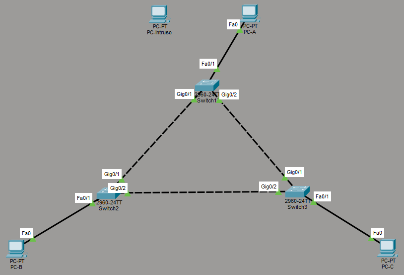

# Semana No. 3 (01/08/2026) - Ejercicio práctico

## Descripción

En esta práctica se construirá una red sencilla en **Cisco Packet Tracer** para aprender:

- Cómo proteger un puerto con **Port Security**.
- La diferencia entre `protect`, `restrict` y `shutdown`.
- Cómo **STP** evita bucles cuando existen enlaces redundantes.
- Cómo elegir el switch raíz y verificar el puerto bloqueado.



# Dispositivos

| Cantidad | Dispositivo     | Nombre            |
| -------: | --------------- | ----------------- |
|        3 | Switch 2960     | SW1, SW2 y SW3    |
|        3 | PC              | PC-A, PC-B y PC-C |
|        1 | PC para pruebas | PC-Intruso        |

## Conexiones

| Dispositivo | Puerto        | Conectar con | Puerto |
| ----------- | ------------- | ------------ | ------ |
| SW1         | G0/1          | SW2          | G0/1   |
| SW1         | G0/2          | SW3          | G0/1   |
| SW2         | G0/2          | SW3          | G0/2   |
| PC-A        | FastEthernet0 | SW1          | Fa0/1  |
| PC-B        | FastEthernet0 | SW2          | Fa0/1  |
| PC-C        | FastEthernet0 | SW3          | Fa0/1  |

# Direcciones IP

Configurar cada PC desde **Desktop > IP Configuration**.

| Equipo     | Dirección IP  | Máscara       |
| ---------- | ------------- | ------------- |
| PC-A       | 192.168.10.11 | 255.255.255.0 |
| PC-B       | 192.168.10.12 | 255.255.255.0 |
| PC-C       | 192.168.10.13 | 255.255.255.0 |
| PC-Intruso | 192.168.10.99 | 255.255.255.0 |

El campo **Default Gateway** se deja vacío porque todas las PCs pertenecen a la misma red.

---

# Configuración de los switches

## SW1

SW1 será el switch raíz. El puerto de PC-A utilizará el modo `protect`.

```cisco
enable
configure terminal

hostname SW1
no ip domain-lookup

vlan 10
 name USUARIOS
 exit

interface GigabitEthernet0/1
 description ENLACE_A_SW2
 switchport mode trunk
 switchport trunk allowed vlan 10
 no shutdown
 exit

interface GigabitEthernet0/2
 description ENLACE_A_SW3
 switchport mode trunk
 switchport trunk allowed vlan 10
 no shutdown
 exit

interface FastEthernet0/1
 description PC_A
 switchport mode access
 switchport access vlan 10
 switchport port-security
 switchport port-security maximum 1
 switchport port-security mac-address 0030.A3A3.052D
 switchport port-security violation protect
 spanning-tree portfast
 no shutdown
 exit

spanning-tree mode pvst
spanning-tree vlan 10 priority 4096

end
write memory
```

## SW2

SW2 será el switch raíz de respaldo. El puerto de PC-B utilizará el modo `restrict`.

```cisco
enable
configure terminal

hostname SW2
no ip domain-lookup

vlan 10
 name USUARIOS
 exit

interface GigabitEthernet0/1
 description ENLACE_A_SW1
 switchport mode trunk
 switchport trunk allowed vlan 10
 no shutdown
 exit

interface GigabitEthernet0/2
 description ENLACE_A_SW3
 switchport mode trunk
 switchport trunk allowed vlan 10
 no shutdown
 exit

interface FastEthernet0/1
 description PC_B
 switchport mode access
 switchport access vlan 10
 switchport port-security
 switchport port-security maximum 1
 switchport port-security mac-address sticky
 switchport port-security violation restrict
 spanning-tree portfast
 no shutdown
 exit

spanning-tree mode pvst
spanning-tree vlan 10 priority 8192

end
write memory
```

## SW3

El puerto de PC-C utilizará el modo `shutdown`.

```cisco
enable
configure terminal

hostname SW3
no ip domain-lookup

vlan 10
 name USUARIOS
 exit

interface GigabitEthernet0/1
 description ENLACE_A_SW1
 switchport mode trunk
 switchport trunk allowed vlan 10
 no shutdown
 exit

interface GigabitEthernet0/2
 description ENLACE_A_SW2
 switchport mode trunk
 switchport trunk allowed vlan 10
 no shutdown
 exit

interface FastEthernet0/1
 description PC_C
 switchport mode access
 switchport access vlan 10
 switchport port-security
 switchport port-security maximum 1
 switchport port-security mac-address sticky
 switchport port-security violation shutdown
 spanning-tree portfast
 no shutdown
 exit

spanning-tree mode pvst
spanning-tree vlan 10 priority 12288

end
write memory
```

Las prioridades hacen que SW1 sea el switch raíz (deben ser múltiplos de 4096):

| Switch | Prioridad | Función          |
| ------ | --------: | ---------------- |
| SW1    |      4096 | Raíz principal   |
| SW2    |      8192 | Raíz de respaldo |
| SW3    |     12288 | Switch de acceso |

---

# Paso 1: comprobar la comunicación

Desde PC-A abrir **Desktop > Command Prompt** y ejecutar:

```text
ping 192.168.10.12
ping 192.168.10.13
```

Desde PC-B ejecutar:

```text
ping 192.168.10.11
```

El primer ping puede fallar mientras se aprende la información ARP. Repetirlo si es necesario.

Estos primeros pings también permiten que Port Security aprenda automáticamente las MAC de las PCs.

# Paso 2: comprobar STP

En SW1 ejecutar:

```cisco
show spanning-tree vlan 10
```

SW1 debe mostrar el mensaje:

```text
This bridge is the root
```

En SW2 y SW3 ejecutar:

```cisco
show spanning-tree vlan 10
show spanning-tree blockedports
```

Uno de los puertos del enlace entre SW2 y SW3 debe aparecer como bloqueado. Con esta configuración, normalmente será `GigabitEthernet0/2` de SW3.

Aunque exista un puerto bloqueado, PC-A, PC-B y PC-C deben poder comunicarse.

## Prueba de redundancia

1. Desconectar el cable entre SW1 y SW3.
2. Esperar aproximadamente 30 segundos.
3. Ejecutar desde PC-A:

```text
ping 192.168.10.13
```

La comunicación debe recuperarse porque STP habilitará el enlace entre SW2 y SW3.

Volver a conectar el cable al terminar.

# Prueba con RSTP

RSTP ofrece una convergencia más rápida. Para utilizarlo, ejecutar en los tres switches:

```cisco
enable
configure terminal
spanning-tree mode rapid-pvst
end
write memory
```

Verificar con:

```cisco
show spanning-tree summary
show spanning-tree vlan 10
```

# Paso 3: probar Port Security

## Verificar las MAC seguras

Ejecutar en cada switch:

```cisco
show port-security
show port-security interface FastEthernet0/1
show port-security address
```

Debe aparecer una dirección `SecureSticky` en `FastEthernet0/1`.

## Modo protect en SW1

1. Desconectar PC-A de `Fa0/1` de SW1.
2. Conectar PC-Intruso en ese puerto.
3. Desde PC-Intruso ejecutar:

```text
ping 192.168.10.12
```

4. En SW1 ejecutar:

```cisco
show port-security interface FastEthernet0/1
```

El ping debe fallar, pero el puerto continúa activo.

Después, desconectar PC-Intruso y volver a conectar PC-A.

## Modo restrict en SW2

1. Desconectar PC-B de `Fa0/1` de SW2.
2. Conectar PC-Intruso en ese puerto.
3. Ejecutar desde PC-Intruso:

```text
ping 192.168.10.11
```

4. En SW2 ejecutar:

```cisco
show port-security interface FastEthernet0/1
```

El ping debe fallar, el puerto continúa activo y el contador `SecurityViolation` aumenta.

```cisco
show logging
```

Después, desconectar PC-Intruso y volver a conectar PC-B.

## Modo shutdown en SW3

1. Desconectar PC-C de `Fa0/1` de SW3.
2. Conectar PC-Intruso en ese puerto.
3. Ejecutar desde PC-Intruso:

```text
ping 192.168.10.11
```

4. En SW3 ejecutar:

```cisco
show port-security interface FastEthernet0/1
show interfaces status
```

El ping debe fallar y el puerto debe quedar en estado `Secure-shutdown` o `err-disabled`.

## Recuperar el puerto de SW3

Desconectar PC-Intruso, volver a conectar PC-C y ejecutar:

```cisco
enable
configure terminal
interface FastEthernet0/1
 shutdown
 no shutdown
end
```

# Comandos de verificación

| Comando                              | Propósito                                        |
| ------------------------------------ | ------------------------------------------------ |
| `show vlan brief`                    | Ver la VLAN 10 y sus puertos.                    |
| `show interfaces trunk`              | Verificar los enlaces trunk.                     |
| `show port-security`                 | Ver los puertos protegidos.                      |
| `show port-security interface fa0/1` | Ver los detalles de Port Security.               |
| `show port-security address`         | Ver las MAC seguras aprendidas.                  |
| `show spanning-tree vlan 10`         | Ver el switch raíz y los estados de los puertos. |
| `show spanning-tree summary`         | Ver el modo STP configurado.                     |
| `show spanning-tree blockedports`    | Identificar los puertos bloqueados.              |
| `show interfaces status`             | Identificar puertos en `err-disabled`.           |
