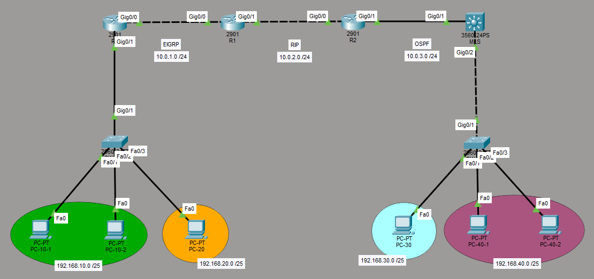

# Semana No. 4 (01/08/2026) - Ejercicio práctico

## Descripción

En esta práctica se construirá una red en **Cisco Packet Tracer** para aprender:

- Cómo configurar **EIGRP**, **RIP versión 2** y **OSPF**.
- Cómo formar vecindades entre dispositivos.
- Cómo redistribuir rutas entre protocolos diferentes.
- Cómo interpretar la tabla de enrutamiento.
- Cómo comprobar la comunicación entre todas las VLAN.



# Direccionamiento IP

## Enlaces entre dispositivos de capa 3

| Dispositivo | Interfaz | Dirección IP | Máscara       | Conecta con |
| ----------- | -------- | ------------ | ------------- | ----------- |
| R0          | G0/0     | 10.0.1.1     | 255.255.255.0 | R1 G0/0     |
| R1          | G0/0     | 10.0.1.2     | 255.255.255.0 | R0 G0/0     |
| R1          | G0/1     | 10.0.2.1     | 255.255.255.0 | R2 G0/0     |
| R2          | G0/0     | 10.0.2.2     | 255.255.255.0 | R1 G0/1     |
| R2          | G0/1     | 10.0.3.1     | 255.255.255.0 | MLS G0/1    |
| MLS         | G0/1     | 10.0.3.2     | 255.255.255.0 | R2 G0/1     |

## VLAN y equipos finales

| VLAN | Red             | Gateway      | Equipo  | Dirección IP  |
| ---: | --------------- | ------------ | ------- | ------------- |
|   10 | 192.168.10.0/25 | 192.168.10.1 | PC-10-1 | 192.168.10.10 |
|   10 | 192.168.10.0/25 | 192.168.10.1 | PC-10-2 | 192.168.10.11 |
|   20 | 192.168.20.0/25 | 192.168.20.1 | PC-20   | 192.168.20.10 |
|   30 | 192.168.30.0/25 | 192.168.30.1 | PC-30   | 192.168.30.10 |
|   40 | 192.168.40.0/25 | 192.168.40.1 | PC-40-1 | 192.168.40.10 |
|   40 | 192.168.40.0/25 | 192.168.40.1 | PC-40-2 | 192.168.40.11 |

La máscara de todas las PCs es `255.255.255.128`.

---

# Paso 1: configurar las VLAN

## Switch izquierdo

Crear las VLAN 10 y 20. El enlace hacia R0 será trunk para permitir el enrutamiento inter-VLAN mediante subinterfaces.

```cisco
enable
configure terminal

hostname SW-IZQ
no ip domain-lookup

vlan 10
 name VLAN10
 exit
vlan 20
 name VLAN20
 exit

interface GigabitEthernet0/1
 switchport mode trunk
 switchport trunk allowed vlan 10,20
 no shutdown
 exit

interface range FastEthernet0/1 - 2
 switchport mode access
 switchport access vlan 10
 spanning-tree portfast
 no shutdown
 exit

interface FastEthernet0/3
 switchport mode access
 switchport access vlan 20
 spanning-tree portfast
 no shutdown
 exit

end
write memory
```

Si la topología utiliza dos switches en el lado izquierdo, el enlace entre ambos también debe configurarse como trunk y permitir las VLAN 10 y 20.

## Switch derecho

Crear las VLAN 30 y 40. El enlace hacia el multilayer switch será trunk.

```cisco
enable
configure terminal

hostname SW-DER
no ip domain-lookup

vlan 30
 name VLAN30
 exit
vlan 40
 name VLAN40
 exit

interface GigabitEthernet0/1
 switchport mode trunk
 switchport trunk allowed vlan 30,40
 no shutdown
 exit

interface FastEthernet0/1
 switchport mode access
 switchport access vlan 30
 spanning-tree portfast
 no shutdown
 exit

interface range FastEthernet0/2 - 3
 switchport mode access
 switchport access vlan 40
 spanning-tree portfast
 no shutdown
 exit

end
write memory
```

# Paso 2: configurar las interfaces de capa 3

## R0

Los routers utilizarán subinterfaces para funcionar como gateway de las VLAN 10 y 20.

```cisco
enable
configure terminal

hostname R0
no ip domain-lookup

interface GigabitEthernet0/0
 ip address 10.0.1.1 255.255.255.0
 no shutdown
 exit

interface GigabitEthernet0/1
 no ip address
 no shutdown
 exit

interface GigabitEthernet0/1.10
 encapsulation dot1Q 10
 ip address 192.168.10.1 255.255.255.128
 exit

interface GigabitEthernet0/1.20
 encapsulation dot1Q 20
 ip address 192.168.20.1 255.255.255.128
 exit

end
write memory
```

## R1

```cisco
enable
configure terminal

hostname R1
no ip domain-lookup

interface GigabitEthernet0/0
 ip address 10.0.1.2 255.255.255.0
 no shutdown
 exit

interface GigabitEthernet0/1
 ip address 10.0.2.1 255.255.255.0
 no shutdown
 exit

end
write memory
```

## R2

```cisco
enable
configure terminal

hostname R2
no ip domain-lookup

interface GigabitEthernet0/0
 ip address 10.0.2.2 255.255.255.0
 no shutdown
 exit

interface GigabitEthernet0/1
 ip address 10.0.3.1 255.255.255.0
 no shutdown
 exit

end
write memory
```

## Multilayer switch

Se debe activar el enrutamiento, convertir `G0/1` en puerto capa 3 y crear las interfaces virtuales que funcionarán como gateway de las VLAN 30 y 40.

```cisco
enable
configure terminal

hostname MLS
no ip domain-lookup

ip routing

vlan 30
 name VLAN30
 exit
vlan 40
 name VLAN40
 exit

interface GigabitEthernet0/1
 no switchport
 ip address 10.0.3.2 255.255.255.0
 no shutdown
 exit

interface GigabitEthernet0/2
 switchport trunk encapsulation dot1q
 switchport mode trunk
 switchport trunk allowed vlan 30,40
 no shutdown
 exit

interface Vlan30
 ip address 192.168.30.1 255.255.255.128
 no shutdown
 exit

interface Vlan40
 ip address 192.168.40.1 255.255.255.128
 no shutdown
 exit

end
write memory
```

> Algunos modelos no aceptan `switchport trunk encapsulation dot1q`. Si aparece un error, omitir esa línea y continuar con `switchport mode trunk`.

# Paso 3: configurar EIGRP en R0 y R1

## R0

```cisco
configure terminal

router eigrp 1
 no auto-summary
 network 10.0.1.0 0.0.0.255
 network 192.168.10.0 0.0.0.127
 network 192.168.20.0 0.0.0.127
 exit

end
write memory
```

## R1

R1 redistribuirá las rutas de RIP hacia EIGRP. EIGRP necesita una métrica compuesta: ancho de banda, retardo, confiabilidad, carga y MTU.

```cisco
configure terminal

router eigrp 1
 no auto-summary
 network 10.0.1.0 0.0.0.255
 redistribute rip metric 10000 100 255 1 1500
 exit

end
write memory
```

Verificar la vecindad:

```cisco
show ip eigrp neighbors
show ip route eigrp
```

R0 y R1 deben aparecer como vecinos.

# Paso 4: configurar RIP en R1 y R2

Se utilizará RIP versión 2 y se desactivará el resumen automático.

## R1

```cisco
configure terminal

router rip
 version 2
 no auto-summary
 network 10.0.2.0
 redistribute eigrp 1 metric 1
 exit

end
write memory
```

## R2

R2 redistribuirá hacia RIP las rutas aprendidas mediante OSPF.

```cisco
configure terminal

router rip
 version 2
 no auto-summary
 network 10.0.2.0
 redistribute ospf 1 metric 1
 exit

end
write memory
```

RIP usa el conteo de saltos. Por eso se define `metric 1` al redistribuir.

Verificar:

```cisco
show ip protocols
show ip route rip
```

# Paso 5: configurar OSPF en R2 y MLS

## R2

```cisco
configure terminal

router ospf 1
 router-id 2.2.2.2
 network 10.0.3.0 0.0.0.255 area 0
 redistribute rip subnets
 exit

end
write memory
```

La palabra `subnets` permite incluir las subredes aprendidas mediante RIP.

## Multilayer switch

```cisco
configure terminal

router ospf 1
 router-id 3.3.3.3
 network 10.0.3.0 0.0.0.255 area 0
 network 192.168.30.0 0.0.0.127 area 0
 network 192.168.40.0 0.0.0.127 area 0
 exit

end
write memory
```

Verificar la adyacencia:

```cisco
show ip ospf neighbor
show ip route ospf
```

R2 y MLS deben aparecer como vecinos OSPF.

---

# Paso 6: comprobar las rutas

Ejecutar en todos los dispositivos de capa 3:

```cisco
show ip route
```

Los códigos más importantes son:

| Código | Significado                            |
| ------ | -------------------------------------- |
| `C`    | Red conectada directamente             |
| `D`    | Ruta aprendida mediante EIGRP          |
| `D EX` | Ruta externa redistribuida hacia EIGRP |
| `R`    | Ruta aprendida mediante RIP            |
| `O`    | Ruta aprendida mediante OSPF           |
| `O E2` | Ruta externa redistribuida hacia OSPF  |

# Paso 7: pruebas de conectividad

Desde PC-10-1 ejecutar:

```text
ping 192.168.10.1
ping 192.168.20.10
ping 192.168.30.10
ping 192.168.40.10
```

Desde PC-40-1 ejecutar:

```text
ping 192.168.40.1
ping 192.168.10.10
```

El primer ping puede fallar mientras se completa ARP. Repetirlo si es necesario.

También se puede observar el camino seguido por los paquetes:

```text
tracert 192.168.40.10
```

# Solución de problemas

Si una red no aparece o un ping falla, revisar en este orden:

1. Confirmar direcciones, máscaras y gateways.
2. Verificar que las interfaces estén `up/up`.
3. Revisar que las VLAN existan y los enlaces trunk las permitan.
4. Confirmar los comandos `network` y sus wildcard masks.
5. Verificar las vecindades EIGRP y OSPF.
6. Revisar la redistribución en R1 y R2.
7. Consultar nuevamente `show ip route`.

# Comandos de verificación

| Comando                   | Propósito                                 |
| ------------------------- | ----------------------------------------- |
| `show ip interface brief` | Ver el estado y las IP de las interfaces. |
| `show interfaces trunk`   | Verificar los enlaces trunk.              |
| `show vlan brief`         | Comprobar las VLAN y puertos de acceso.   |
| `show ip protocols`       | Ver los protocolos y redes anunciadas.    |
| `show ip eigrp neighbors` | Verificar vecinos EIGRP.                  |
| `show ip ospf neighbor`   | Verificar vecinos OSPF.                   |
| `show ip route`           | Consultar toda la tabla de enrutamiento.  |
| `show ip route rip`       | Mostrar únicamente rutas RIP.             |
| `show ip route ospf`      | Mostrar únicamente rutas OSPF.            |
| `show running-config`     | Revisar la configuración activa.          |
| `ping`                    | Comprobar conectividad.                   |
| `traceroute` / `tracert`  | Observar el camino hacia un destino.      |
