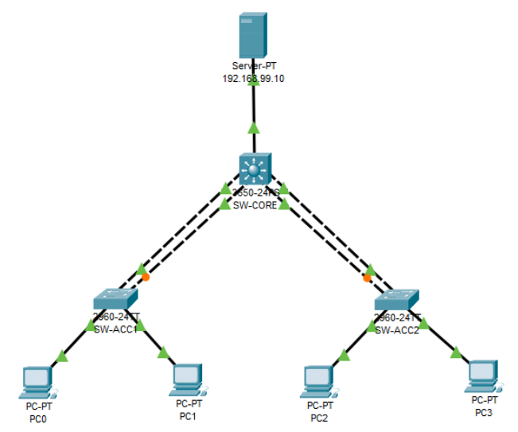

# Semana No. 5 (08/08/2026) - Ejercicio práctico

## Descripción

Topología realizada en **Cisco Packet Tracer** para practicar:

- EtherChannel con **LACP** y **PAgP**.
- VLAN 10, 20 y 99.
- Enrutamiento inter-VLAN.
- DHCP centralizado mediante `ip helper-address`.

## Topología



## Dispositivos

| Dispositivo                | Cantidad | Función             |
| -------------------------- | -------: | ------------------- |
| Switch multicapa 3650-24PS |        1 | Core y enrutamiento |
| Switch 2960                |        2 | Acceso              |
| Server-PT                  |        1 | Servidor DHCP       |
| PC                         |        4 | Hosts               |

## Plan de direccionamiento

| VLAN | Nombre    | Red               | Gateway        |
| ---: | --------- | ----------------- | -------------- |
|   10 | Ventas    | `192.168.10.0/24` | `192.168.10.1` |
|   20 | Sistemas  | `192.168.20.0/24` | `192.168.20.1` |
|   99 | Servicios | `192.168.99.0/24` | `192.168.99.1` |

Servidor DHCP: `192.168.99.10/24`  
Gateway: `192.168.99.1`

## 1. Configuración básica

Aplicar en cada switch cambiando el `hostname`.

```cisco
enable
configure terminal
hostname SW-CORE
no ip domain-lookup
enable secret cisco123
end
write memory
```

Hostnames: `SW-CORE`, `SW-ACC1`, `SW-ACC2`.

## 2. VLAN y puertos de acceso

Crear en los tres switches:

```cisco
configure terminal
vlan 10
 name Ventas
vlan 20
 name Sistemas
vlan 99
 name Servicios
```

### SW-ACC1 — VLAN 10

```cisco
interface range FastEthernet0/3 - 4
 switchport mode access
 switchport access vlan 10
 no shutdown
```

### SW-ACC2 — VLAN 20

```cisco
interface range FastEthernet0/3 - 4
 switchport mode access
 switchport access vlan 20
 no shutdown
```

### SW-CORE — Servidor en VLAN 99

```cisco
interface GigabitEthernet1/0/24
 switchport mode access
 switchport access vlan 99
 no shutdown
```

## 3. EtherChannel LACP

Entre `SW-CORE` y `SW-ACC1`, usando **Port-channel 1**.

### SW-CORE

```cisco
interface range GigabitEthernet1/0/1 - 2
 shutdown
 channel-group 1 mode active
 no shutdown
interface Port-channel1
 switchport trunk encapsulation dot1q
 switchport mode trunk
 switchport trunk allowed vlan 10,20,99
```

### SW-ACC1

```cisco
interface range GigabitEthernet0/1 - 2
 shutdown
 channel-group 1 mode active
 no shutdown
interface Port-channel1
 switchport mode trunk
 switchport trunk allowed vlan 10,20,99
```

## 4. EtherChannel PAgP

Entre `SW-CORE` y `SW-ACC2`, usando **Port-channel 2**.

### SW-CORE

```cisco
interface range GigabitEthernet1/0/3 - 4
 shutdown
 channel-group 2 mode desirable
 no shutdown
interface Port-channel2
 switchport trunk encapsulation dot1q
 switchport mode trunk
 switchport trunk allowed vlan 10,20,99
```

### SW-ACC2

```cisco
interface range GigabitEthernet0/1 - 2
 shutdown
 channel-group 2 mode desirable
 no shutdown
interface Port-channel2
 switchport mode trunk
 switchport trunk allowed vlan 10,20,99
```

## 5. Enrutamiento inter-VLAN y DHCP Relay

Configurar en `SW-CORE`:

```cisco
ip routing
interface Vlan10
 ip address 192.168.10.1 255.255.255.0
 ip helper-address 192.168.99.10
 no shutdown
interface Vlan20
 ip address 192.168.20.1 255.255.255.0
 ip helper-address 192.168.99.10
 no shutdown
interface Vlan99
 ip address 192.168.99.1 255.255.255.0
 no shutdown
```

La VLAN 99 no necesita `ip helper-address` porque el servidor está en la misma subred.

## 6. Servidor DHCP

IP estática del servidor:

- IP: `192.168.99.10`
- Máscara: `255.255.255.0`
- Gateway: `192.168.99.1`

Pools DHCP:
| Pool | Gateway | IP inicial | DNS | Máx. |
|---|---|---|---|---:|
| VLAN10_Ventas | `192.168.10.1` | `192.168.10.100` | `8.8.8.8` | 50 |
| VLAN20_Sistemas | `192.168.20.1` | `192.168.20.100` | `8.8.8.8` | 50 |

Máscara para ambos pools: `255.255.255.0`.

## 7. Verificación

Configurar las 4 PCs en modo **DHCP**.

Resultados esperados:

- VLAN 10: IP entre `192.168.10.100` y `192.168.10.149`.
- VLAN 20: IP entre `192.168.20.100` y `192.168.20.149`.
- Ping entre PCs de distintas VLAN.
- Ping hacia el servidor `192.168.99.10`.
- La comunicación continúa si se desconecta un enlace físico del EtherChannel.

Comandos de verificación:

```cisco
show etherchannel summary
show interfaces trunk
show vlan brief
show ip interface brief
show ip route connected
```

Se espera observar:

- `Po1(SU)` con **LACP**.
- `Po2(SU)` con **PAgP**.
