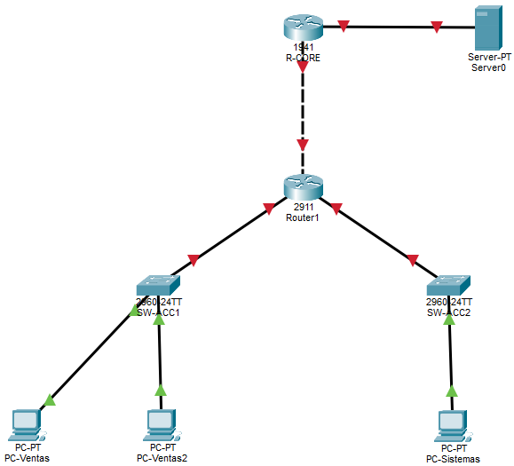

# Semana No. 6 (22/08/2026) - Ejercicio práctico

## Descripción

Topología realizada en **Cisco Packet Tracer** para practicar:

- Capa de transporte: diferencias entre **TCP** y **UDP**.
- Diseño de red con el **modelo jerárquico**: núcleo, distribución y acceso.
- Enrutamiento entre las redes de Ventas, Sistemas y Servicios.
- Seguridad en capa 3 mediante **ACL estándar y extendida**.
- Aplicación del principio de mínimo privilegio sobre los servicios HTTP y DNS.

## Topología



## Dispositivos

| Dispositivo | Cantidad | Función                                   |
| ----------- | -------: | ----------------------------------------- |
| Router      |        2 | Núcleo, distribución, enrutamiento y ACLs |
| Switch 2960 |        2 | Acceso para Ventas y Sistemas             |
| Server-PT   |        1 | Servicios HTTP y DNS                      |
| PC          |        3 | Hosts de prueba                           |

## Plan de direccionamiento

| Segmento  | Red               | Gateway        | Hosts principales                |
| --------- | ----------------- | -------------- | -------------------------------- |
| Ventas    | `192.168.10.0/24` | `192.168.10.1` | `192.168.10.10`, `192.168.10.11` |
| Sistemas  | `192.168.20.0/24` | `192.168.20.1` | `192.168.20.10`                  |
| Servicios | `192.168.99.0/24` | `192.168.99.1` | Servidor `192.168.99.10`         |
| Core-Dist | `10.0.0.0/30`     | -              | R-CORE `.1`, R-DIST `.2`         |

## 1. Capa de transporte: TCP y UDP

| Protocolo | Característica esencial                                       | Servicio del ejercicio |
| --------- | ------------------------------------------------------------- | ---------------------- |
| TCP       | Orientado a conexión, confiable y con control de entrega      | HTTP, puerto `80`      |
| UDP       | No orientado a conexión, rápido y sin confirmación de entrega | DNS, puerto `53`       |

Las ACLs extendidas permiten distinguir estos protocolos y filtrar tráfico según origen, destino y puerto.

## 2. Enrutamiento de la topología

### R-CORE

```cisco
interface GigabitEthernet0/0
 description Conexion-Servidor
 ip address 192.168.99.1 255.255.255.0
 no shutdown
interface GigabitEthernet0/1
 description Enlace-a-R-DIST
 ip address 10.0.0.1 255.255.255.252
 no shutdown

ip route 192.168.10.0 255.255.255.0 10.0.0.2
ip route 192.168.20.0 255.255.255.0 10.0.0.2
```

### R-DIST

```cisco
interface GigabitEthernet0/0
 description Enlace-a-R-CORE
 ip address 10.0.0.2 255.255.255.252
 no shutdown
interface GigabitEthernet0/1
 description LAN-Ventas
 ip address 192.168.10.1 255.255.255.0
 no shutdown
interface GigabitEthernet0/2
 description LAN-Sistemas
 ip address 192.168.20.1 255.255.255.0
 no shutdown

ip route 192.168.99.0 255.255.255.0 10.0.0.1
```

Antes de configurar las ACLs se debe comprobar que todos los segmentos tengan conectividad.

## 3. Servidor HTTP y DNS

Configurar el servidor con:

- IP: `192.168.99.10`
- Máscara: `255.255.255.0`
- Gateway: `192.168.99.1`
- HTTP: servicio **On**.
- DNS: servicio **On** y registro A `www.usac.local` → `192.168.99.10`.

## 4. ACL estándar: aislar Ventas de Sistemas

Una ACL estándar solo examina la IP de origen, por lo que se coloca cerca del destino. La ACL 10 se aplica en `Gi0/2` de R-DIST, saliendo hacia Sistemas:

```cisco
access-list 10 deny 192.168.10.0 0.0.0.255
access-list 10 permit any

interface GigabitEthernet0/2
 ip access-group 10 out
```

Resultado: Ventas no puede llegar a Sistemas, pero conserva acceso a otros destinos permitidos.

## 5. ACL extendida: controlar HTTP y DNS

Una ACL extendida filtra por protocolo, origen, destino y puerto; se recomienda colocarla cerca del origen. La ACL 110 entra por `Gi0/1` desde Ventas:

```cisco
access-list 110 deny tcp 192.168.10.0 0.0.0.255 host 192.168.99.10 eq 80
access-list 110 permit udp 192.168.10.0 0.0.0.255 host 192.168.99.10 eq 53
access-list 110 permit icmp 192.168.10.0 0.0.0.255 any
access-list 110 deny ip 192.168.10.0 0.0.0.255 host 192.168.99.10
access-list 110 permit ip any any

interface GigabitEthernet0/1
 ip access-group 110 in
```

Esta política bloquea HTTP/TCP desde Ventas, permite DNS/UDP y ping para diagnóstico, niega otros accesos de Ventas al servidor y permite el tráfico restante.

Consideraciones importantes:

- Las reglas se evalúan de arriba hacia abajo y se usa la primera coincidencia.
- Toda ACL termina con un `deny` implícito; por eso deben agregarse los permisos necesarios.
- ACL estándar: cerca del destino. ACL extendida: cerca del origen.

## 6. Verificación

| Prueba                                 | Resultado esperado       |
| -------------------------------------- | ------------------------ |
| Ping de Ventas a Sistemas              | Falla por ACL 10         |
| Ping de Ventas al servidor             | Responde                 |
| HTTP de Ventas a `192.168.99.10`       | Falla por ACL 110        |
| HTTP de Sistemas a `192.168.99.10`     | Responde                 |
| `nslookup www.usac.local` desde Ventas | Resuelve `192.168.99.10` |
| Ping de Sistemas a Ventas              | Responde                 |

Comandos de verificación:

```cisco
show access-lists
show ip interface GigabitEthernet0/1
show ip interface GigabitEthernet0/2
show running-config | section access-list
```
