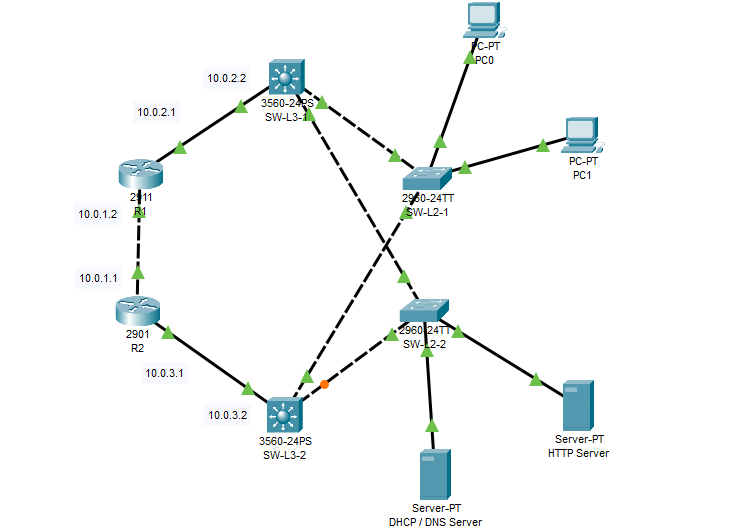

# Semana No. 8 - Ejercicio práctico

## Descripción

Topología realizada en **Cisco Packet Tracer** para practicar:

- Segmentación de la red mediante **VLANs** y propagación con **VTP**.
- Enrutamiento inter-VLAN usando **SVIs** en switches multicapa.
- Redundancia del gateway con **HSRP** y referencia a **VRRP**.
- Asignación automática de direcciones mediante **DHCP relay**.
- Resolución de nombres con **DNS** y publicación de un servicio **HTTP**.

## Topología



## Dispositivos

| Dispositivo    | Cantidad | Función principal                        |
| -------------- | -------: | ---------------------------------------- |
| Router 2911    |        2 | Conectividad entre las redes de tránsito |
| Switch 3560 L3 |        2 | SVIs, inter-VLAN routing y HSRP          |
| Switch 2960 L2 |        2 | Acceso, VLANs, VTP y enlaces troncales   |
| Server-PT      |        2 | Servicios DHCP/DNS y HTTP                |
| PC-PT          |        2 | Clientes de la VLAN de datos             |

## Plan de direccionamiento

| Segmento             | Red / dirección   | Uso                               |
| -------------------- | ----------------- | --------------------------------- |
| VLAN 10 - Datos      | `192.168.10.0/24` | Clientes y SVIs                   |
| VIP HSRP VLAN 10     | `192.168.10.1`    | Gateway virtual de los clientes   |
| SW-L3-1 / SW-L3-2    | `.2` / `.3`       | SVIs de la VLAN 10                |
| VLAN 20 - Servidores | `192.168.20.0/24` | Servidores y SVIs                 |
| VIP HSRP VLAN 20     | `192.168.20.1`    | Gateway virtual de los servidores |
| DHCP/DNS / HTTP      | `.10` / `.20`     | Servicios de red                  |
| Enlace R1-R2         | `10.0.1.0/24`     | R2 `.1`, R1 `.2`                  |
| R1-SW-L3-1           | `10.0.2.0/24`     | R1 `.1`, SW-L3-1 `.2`             |
| R2-SW-L3-2           | `10.0.3.0/24`     | R2 `.1`, SW-L3-2 `.2`             |

## 1. Switches de acceso y VTP

En ambos switches capa 2 se usa el dominio VTP `lab5`. Cambiar el `hostname` y el puerto troncal según el dispositivo.

```cisco
enable
configure terminal
hostname SW-L2-1
no ip domain-lookup
vtp version 2
vtp domain lab5
vtp password 123
vtp mode client

interface range FastEthernet0/2-10
 switchport mode access
 switchport access vlan 10
 no shutdown
interface range FastEthernet0/12-20
 switchport mode access
 switchport access vlan 20
 no shutdown
interface FastEthernet0/1
 switchport mode trunk
 switchport trunk allowed vlan 10,20
 no shutdown
end
write memory
```

## 2. Switches multicapa

Los switches L3 actúan como servidores VTP, crean las VLANs y habilitan el enrutamiento entre ellas.

```cisco
enable
configure terminal
hostname SW-L3-1
ip routing
vtp version 2
vtp domain lab5
vtp password 123
vtp mode server
vlan 10
 name DATOS
vlan 20
 name SERVIDORES

interface vlan 10
 ip address 192.168.10.2 255.255.255.0
 ip helper-address 192.168.20.10
 no shutdown
interface vlan 20
 ip address 192.168.20.2 255.255.255.0
 no shutdown

interface FastEthernet0/1
 switchport trunk encapsulation dot1q
 switchport mode trunk
 switchport trunk allowed vlan 10,20
 no shutdown
interface GigabitEthernet0/1
 no switchport
 ip address 10.0.2.2 255.255.255.0
 no shutdown
```

Para SW-L3-2, el enlace enrutado hacia R2 usa `10.0.3.2/24`.

## 3. Redundancia con HSRP

SW-L3-2 tiene prioridad `110` y funciona como **Active**; SW-L3-1 conserva la prioridad `100` y queda como **Standby**. Los clientes siempre utilizan las VIP.

```cisco
! SW-L3-2 - Active
interface vlan 10
 standby version 2
 standby 10 ip 192.168.10.1
 standby 10 priority 110
 standby 10 preempt
interface vlan 20
 standby version 2
 standby 20 ip 192.168.20.1
 standby 20 priority 110
 standby 20 preempt

! SW-L3-1 - Standby
interface vlan 10
 standby version 2
 standby 10 ip 192.168.10.1
 standby 10 priority 100
interface vlan 20
 standby version 2
 standby 20 ip 192.168.20.1
 standby 20 priority 100
```

VRRP puede emplearse como alternativa abierta, reemplazando `standby` por `vrrp`.

## 4. Routers y rutas estáticas

```cisco
! R1
interface GigabitEthernet0/0
 ip address 10.0.1.2 255.255.255.0
 no shutdown
interface GigabitEthernet0/1
 ip address 10.0.2.1 255.255.255.0
 no shutdown
ip route 192.168.10.0 255.255.255.0 10.0.2.2
ip route 192.168.20.0 255.255.255.0 10.0.2.2
ip route 10.0.3.0 255.255.255.0 10.0.1.1

! R2
interface GigabitEthernet0/0
 ip address 10.0.1.1 255.255.255.0
 no shutdown
interface GigabitEthernet0/1
 ip address 10.0.3.1 255.255.255.0
 no shutdown
ip route 192.168.10.0 255.255.255.0 10.0.3.2
ip route 192.168.20.0 255.255.255.0 10.0.3.2
ip route 10.0.2.0 255.255.255.0 10.0.1.2
```

## 5. Servicios DHCP, DNS y HTTP

| Servicio | Configuración principal                                       |
| -------- | ------------------------------------------------------------- |
| DHCP     | Pool `VLAN10-POOL`, rango desde `192.168.10.100`, 50 clientes |
| DHCP     | Gateway `192.168.10.1`, DNS `192.168.20.10`                   |
| DNS      | `www.redes2.com` y `redes2.com` hacia `192.168.20.20`         |
| DNS      | `server.redes2.local` hacia `192.168.20.10`                   |
| HTTP     | `192.168.20.20/24`, gateway `192.168.20.1`                    |

En `SRV-DHCP/DNS`, activar DHCP y DNS desde **Services** y crear el pool y los registros indicados. En `SRV-HTTP`, activar HTTP/HTTPS y editar `index.html`.

## 6. Verificación

| Prueba                         | Resultado esperado                            |
| ------------------------------ | --------------------------------------------- |
| `ipconfig /all` en los PCs     | IP por DHCP, VIP como gateway y DNS correcto  |
| `show standby brief`           | SW-L3-2 Active y SW-L3-1 Standby              |
| Ping a `192.168.20.10` y `.20` | Comunicación inter-VLAN exitosa               |
| `nslookup www.redes2.com`      | Resuelve a `192.168.20.20`                    |
| `http://www.redes2.com`        | Carga la página del servidor HTTP             |
| Apagar el switch L3 activo     | El standby asume la VIP y el ping se recupera |

Comandos útiles:

```cisco
show vtp status
show vlan brief
show interfaces trunk
show ip interface brief
show ip route
show standby brief
show standby vlan 10
show arp
```
